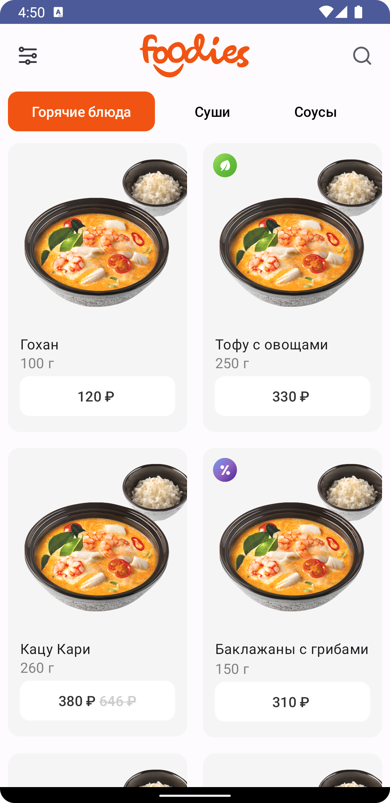
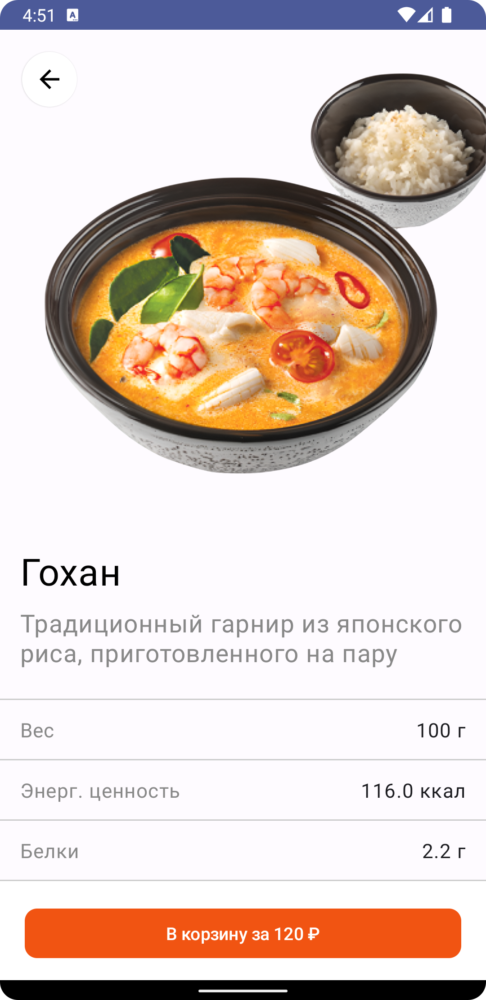
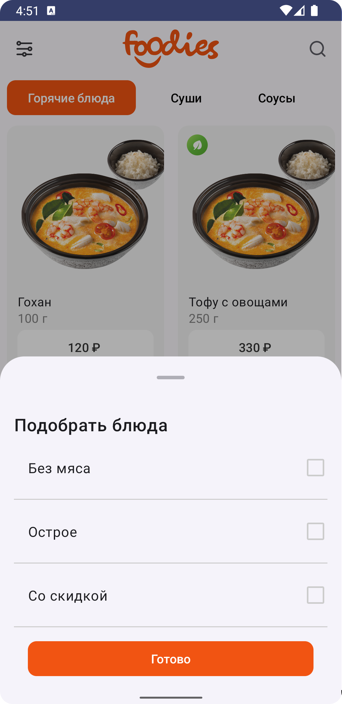
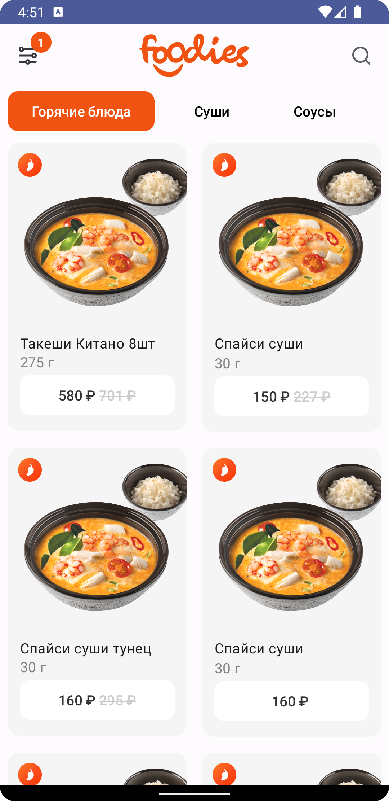
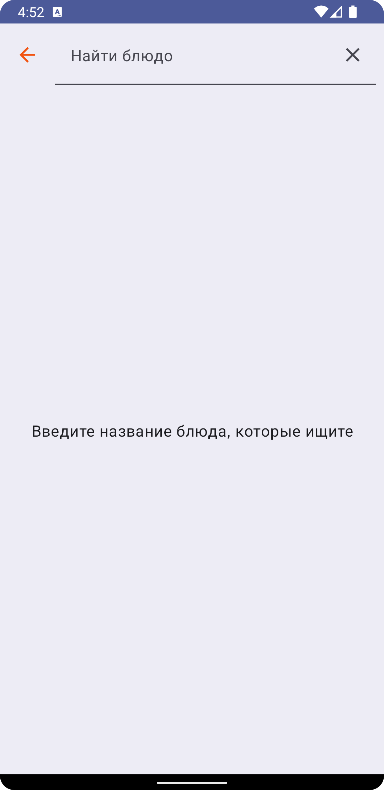
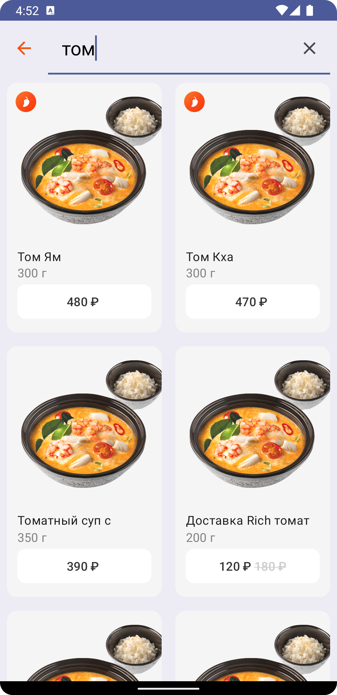
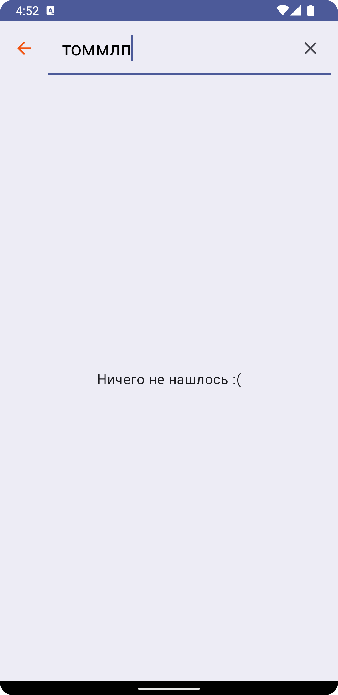
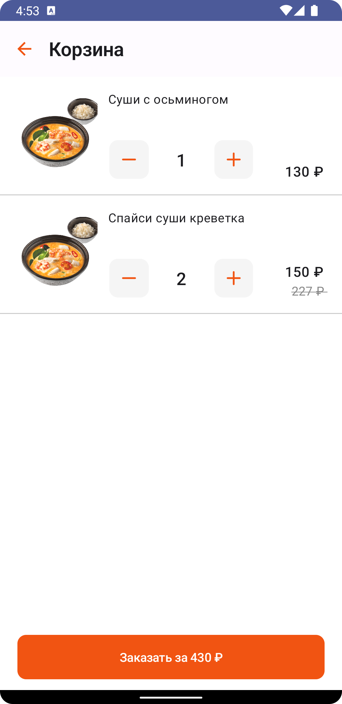
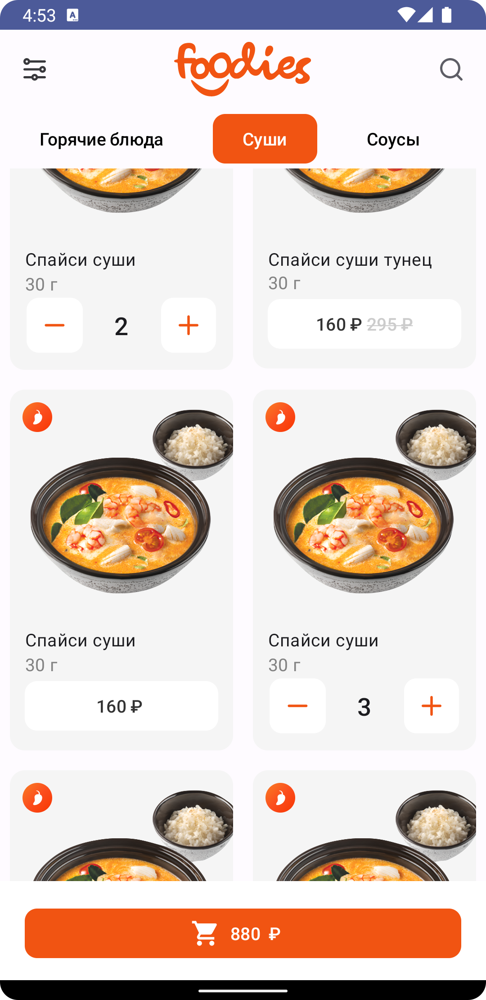

 # Foodies
An app for selecting and ordering food

# Stack
- Kotlin
- MVVM
- Retrofit
- Single Activity
- Hilt(di)
- Coroutines + Flow
- Coil
- Jetpack Compose UI + navigation
- Clean Arch

# Features
### Catalog
- Displays a list of meals by category.
- Ability to add a dish to the basket and remove it.
- Selection of filters for meals.
- Clicking on the price button adds the dish to the basket.
- The button to go to cart appears if it is not empty.
- Clicking on the filters icon opens the bottomSheet.
  
### Search
- The search by dish name is performed without delay.

### Item
- Detailed information about the dish including calories protein fats fat carbohydrates and grams.

### Bucket
- Displays all dishes added to the basket.
- You can change the number of dishes already added.
  

# Screenshots

